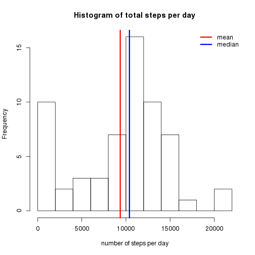

# Reproducible Research: Peer Assessment 1

The data was collected by an anonymous individual wearing a personal activity monitoring device for two months
(from 2012-10-01 to 2012-11-30). 
The number of step was recorded in 5 minute intervals throughout the days.

First, make sure that all code chunks are visible:

```r
opts_chunk$set(echo=TRUE)
```

## Loading and preprocessing the data

The data file `activity.csv` is extracted from the compressed file `activity.zip` and then loaded into the data frame `data`.
The interval data are transformed from the orignial format (hhmm, no digits for leading zeros) 
into minutes passed since the beginning of the day (00:00).
In this way the intervals are spread evenly over the day 
(and gaps in the original data like 50, 55, 100, 105 are transformed into 50, 55, 60, 65).
The structure of the data frame and a summary statistic are displayed.

```r
data <- read.csv(unz("activity.zip", "activity.csv"), colClasses=c("integer", "Date", "integer"))

data$interval <- 60*floor((data$interval+1)/100) + (data$interval %% 100)

str(data)
```

```
## 'data.frame':	17568 obs. of  3 variables:
##  $ steps   : int  NA NA NA NA NA NA NA NA NA NA ...
##  $ date    : Date, format: "2012-10-01" "2012-10-01" ...
##  $ interval: num  0 5 10 15 20 25 30 35 40 45 ...
```

```r
summary(data)
```

```
##      steps            date               interval   
##  Min.   :  0.0   Min.   :2012-10-01   Min.   :   0  
##  1st Qu.:  0.0   1st Qu.:2012-10-16   1st Qu.: 359  
##  Median :  0.0   Median :2012-10-31   Median : 718  
##  Mean   : 37.4   Mean   :2012-10-31   Mean   : 718  
##  3rd Qu.: 12.0   3rd Qu.:2012-11-15   3rd Qu.:1076  
##  Max.   :806.0   Max.   :2012-11-30   Max.   :1435  
##  NA's   :2304
```


## What is mean total number of steps taken per day?

The total steps per day are summed up using the `tapply` function, and the mean and median are determined.

```r
total_steps <- tapply(data$steps, data$date, sum, na.rm=T)

step_mean <- mean(total_steps)
step_mean
```

```
## [1] 9354
```

```r
step_median <- median(total_steps)
step_median
```

```
## [1] 10395
```

The total steps per day are displayed as a histogram.
The mean value of the total number of steps taken per day (9354.23) is highlighted by a vertical red line, 
the median (1.0395 &times; 10<sup>4</sup>) by a vertical blue line.
The mean is shifted to the left relative to the median.

```r
hist(total_steps, breaks=11, 
     xlab="number of steps per day", 
     main="Histogram of total steps per day")
abline(v=step_mean, col="red", lwd=3)
abline(v=step_median, col="blue", lwd=3)
legend(x="topright", legend=c("mean","median"), col=c("red","blue"), bty="n", lwd=3)
```

 


## What is the average daily activity pattern?

To generate an average daily activity pattern the mean of each 5-minutes interval over all days is determined using the `tapply` function. 
The activity pattern is plotted as a time series.

```r
avg_steps <- tapply(data$steps, data$interval, mean, na.rm=T)

hours <- as.numeric(names(avg_steps))/60
plot(hours, avg_steps, type="l", axes=F,
     xlab="time of day (h)", ylab="average number of steps in 5-min interval",
     main="Daily activity pattern")
axis(2)
axis(1, at=0:6*4, labels=paste(0:6*4,":00", sep=""))
```

 

The maximum number of steps occurs in the 5-minutes interval starting at

```r
max_act_num <- which(avg_steps==max(avg_steps))
max_act_int <- data$interval[max_act_num]
sprintf("%02d:%02d", floor(max_act_int/60), max_act_int %% 60)
```

```
## [1] "08:35"
```

The maximum number of steps occurs in the 104th 5-minutes interval of the day 
starting at 8:35.

## Imputing missing values
There are many missing values in the data set (see the data summary statistic at the top of this document), to be exact 2304 
missing values:

```r
sum(is.na(data))
```

```
## [1] 2304
```

The daily activity pattern can be used to impute these missing values. For every missing value the average number of steps in
that 5-minutes interval is used and a new data frame `impute` is created

```r
impute <- transform(data, steps=ifelse(is.na(steps), avg_steps, steps))

summary(impute)
```

```
##      steps            date               interval   
##  Min.   :  0.0   Min.   :2012-10-01   Min.   :   0  
##  1st Qu.:  0.0   1st Qu.:2012-10-16   1st Qu.: 359  
##  Median :  0.0   Median :2012-10-31   Median : 718  
##  Mean   : 37.4   Mean   :2012-10-31   Mean   : 718  
##  3rd Qu.: 27.0   3rd Qu.:2012-11-15   3rd Qu.:1076  
##  Max.   :806.0   Max.   :2012-11-30   Max.   :1435
```

The total steps per day are summed up using the `tapply` function, and the mean and median are determined.

```r
total_impsteps <- tapply(impute$steps, impute$date, sum, na.rm=T)

impstep_mean <- mean(total_impsteps)
impstep_mean
```

```
## [1] 10766
```

```r
impstep_median <- median(total_impsteps)
impstep_median
```

```
## [1] 10766
```

The total steps per day are displayed as a histogram.
The mean value of the total number of steps taken per day (1.0766 &times; 10<sup>4</sup>) is highlighted by a vertical red line, 
the median (1.0766 &times; 10<sup>4</sup>) by a vertical blue line.
The mean and the median overlap.

```r
hist(total_impsteps, breaks=11, 
     xlab="number of steps per day", 
     sub="(missing values imputed)",
     main="Histogram of total steps per day")
abline(v=impstep_mean, col="red", lwd=3)
abline(v=impstep_median, col="blue", lwd=3, lty=2)
legend(x="topright", legend=c("mean","median"), col=c("red","blue"), bty="n", lwd=3)
```

 

## Are there differences in activity patterns between weekdays and weekends?
